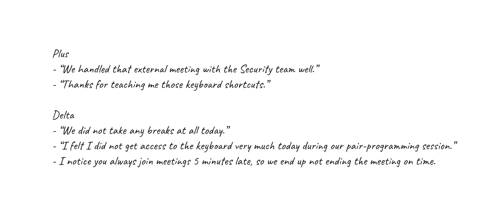

{}

## How to Use this Method

Plus/Delta allows feedback to focus on individual actions rather than team or group based actions generated from a group setting. It focuses on a more frequent feedback with a small audience.

{}
For teams that do not currently have a culture of feedback, the Plus / Delta is a light-weight technique to introduce a regular feedback cycle at a 1:1, individual level.
{}

{}
{}

### Sample Agenda & Prompts

1. Preparation: Set aside 3-5 minutes to think of any Pluses / Deltas during the day, ranging from small to large topics.

   **For example _(Plus)_:**

   - “We handled that external meeting with the Security team well.”
   - “Thanks for teaching me those keyboard shortcuts.”
   - "Your suggestion that we should talk to the Design lead when starting the next user story was spot-on."

   **For example _(Delta)_:**

   - “We did not take any breaks at all today.”
   - “I felt I did not get access to the keyboard very much during our pair-programming session today.”
   - "I notice you always join meetings 5 minutes late, so we end up not ending the meeting on time."

   

2. Find a quiet area or video conference session with just the two of you.

3. Take turns each going over a plus / delta, alternating between pluses and deltas.

4. Depending on the feedback, suggest changes for future working sessions.
   For example: - "Let's ensure that tomorrow at 11 AM and 3 PM we take a 10-minute break." - "Let's try the [Pomodoro technique](/learningpaths/application-development/pair-programming/#describe-the-mechanics-of-the-drivernavigator-style-of-pair-programming) tomorrow and see if it helps us have more balanced pairing sessions." - "If we have back-to-back meetings, let's make sure we end the first meeting on time, so we're not late to the next one."
   {}

{}

## Success/Expected Outcomes

Both parties feel comfortable regularly providing feedback to each other in a clear and concise way, ideally evolving to feedback that can be given as needed rather than during plus/delta session.

After a session of plus/delta both parties will take away actions they should continue doing and activities they can improve during their daily work day.
{}
{}

## Facilitator Notes & Tips

A longer, more formal feedback session might be warranted if the process took longer than 10-15 minutes.

Start doing this daily, scale down to less frequent as both participants feel comfortable.

Sometimes one or both parties are uncomfortable providing deltas or other constructive feedback. If plus/delta sessions consistently do not yield any deltas, try the following techniques:

- Start the session by describing how the day went. Both parties can then work together to extract the pluses and deltas based on these descriptions.
- Implementing a format of “two pluses, one delta” to prompt both parties to suggest deltas in a more structured, blameless manner.
  {}

{}

## Related Practices

- [Speedback Feedback](/practices/speedback/)
  {}

{}

## Recommended References

[Thanks for the Feedback](https://www.penguinrandomhouse.com/books/313485/thanks-for-the-feedback-by-douglas-stone-and-sheila-heen/) By Douglas Stone and Sheila Heen
– Recommended reading as a way to understand how people may interpret your feedback.

[REwork](https://basecamp.com/books/rework) by Jason Fried and David Heinemeier Hansson
{}
